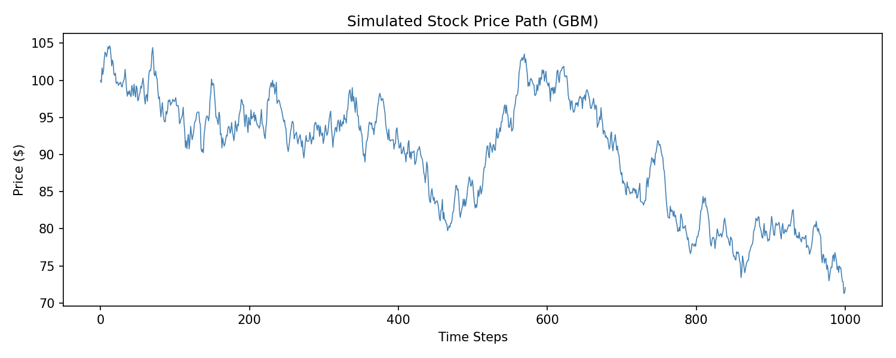
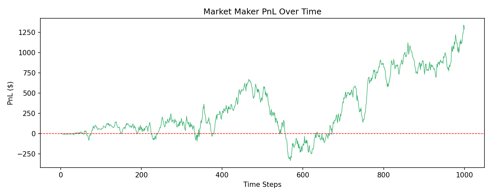
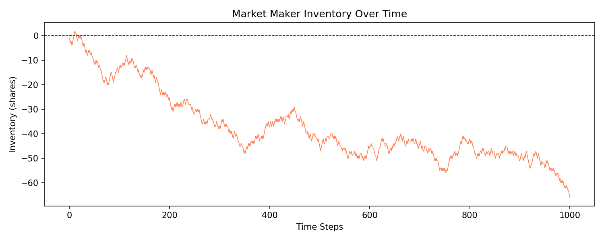
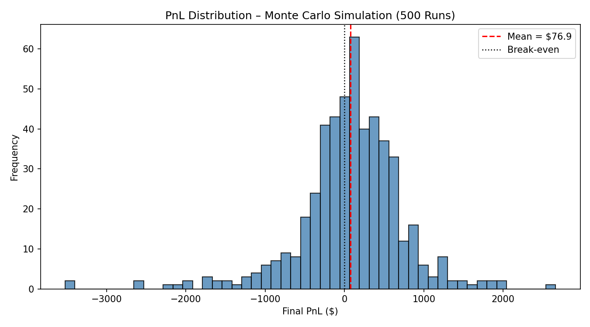
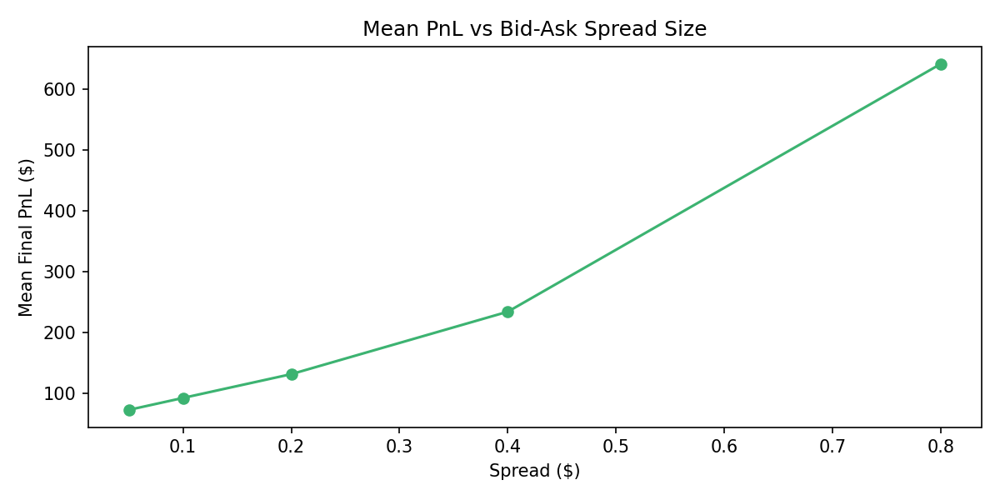
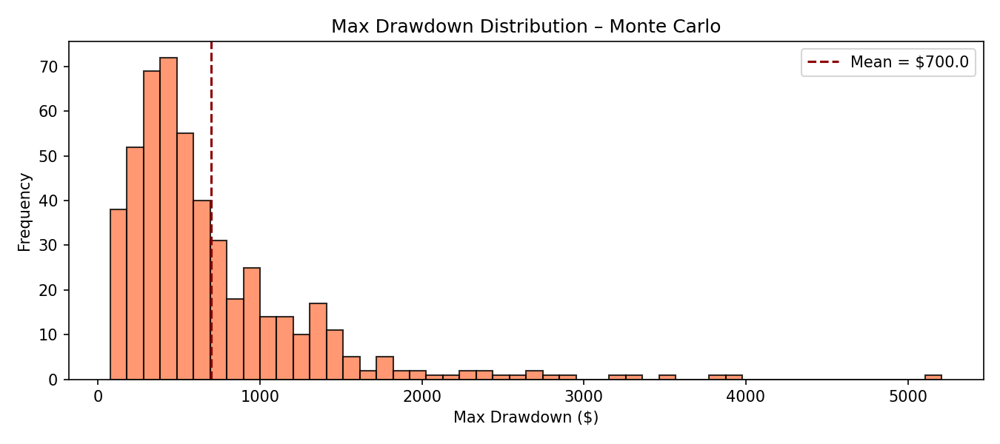

# Market Making Strategy Simulation

A Python simulation of a **basic market-making strategy** using a stochastic stock price model and a simplified limit order book mechanism. Monte Carlo methods are used to analyse strategy performance, PnL distributions, and risk metrics across hundreds of simulated trading sessions.

---

## Project Structure

```
marketsimulator/
├── main.py
├── README.md
└── output_plots/
    ├── 1_price_path.png
    ├── 2_pnl_over_time.png
    ├── 3_inventory.png
    ├── 4_pnl_distribution.png
    ├── 5_spread_vs_pnl.png
    └── 6_max_drawdown.png
```

---

## How It Works

### 1. Price Model - Geometric Brownian Motion (GBM)

Stock price evolves according to:

$$S_{t+1} = S_t \cdot \exp\left(\left(\mu - \frac{\sigma^2}{2}\right)dt + \sigma \, dW\right)$$

Parameters: `S₀ = 100`, `μ = 0.0001`, `σ = 0.01`

### 2. Market Maker Strategy

The market maker continuously quotes a **bid** and **ask** around the mid-price:

```
Bid = mid_price − spread/2
Ask = mid_price + spread/2
```

**Dynamic spread adjustment:** The spread widens proportionally when inventory exposure is high, reducing directional risk:

```python
dynamic_spread = spread × (1 + |inventory| / max_inventory)
```

### 3. Order Flow

At each time step, an order arrives with probability 0.8. Buy and sell orders arrive with equal probability. The market maker fills each order at the quoted bid or ask, earning the spread on each transaction.

### 4. PnL Calculation

```
PnL = cash_balance + inventory × current_price
```

---

## Monte Carlo Results (500 Runs, spread = $0.20)

| Metric | Value |
|---|---|
| Mean Final PnL | $76.87 |
| Std Dev of PnL | $668.00 |
| % Profitable Runs | 60.0% |
| Sharpe-like Ratio | 0.115 |
| Mean Max Drawdown | $699.98 |

**Key findings:**
- The strategy is profitable in 60% of runs, with mean PnL positive at $76.87
- High standard deviation ($668) reflects significant inventory risk from directional price moves
- Mean max drawdown of ~$700 highlights the downside when the market maker accumulates a large unhedged position
- PnL increases monotonically with spread size — wider spreads earn more per trade but reduce order flow

---

## Output Plots

### Simulated Stock Price Path (GBM)


### Market Maker PnL Over Time


### Market Maker Inventory Over Time


*The inventory drifting negative shows the market maker accumulating a short position as the price trended down - a core inventory risk challenge in real market making.*

### PnL Distribution - Monte Carlo (500 Runs)


### Mean PnL vs Bid-Ask Spread Size


### Max Drawdown Distribution - Monte Carlo


---

## Setup & Usage

**Install dependencies:**
```bash
pip install numpy pandas matplotlib
```

**Run the simulation:**
```bash
python main.py
```

All 6 plots are saved to `output_plots/`. Monte Carlo statistics are printed to the terminal.

---

## Concepts Demonstrated

- **Geometric Brownian Motion** - stochastic price process used in options pricing and quant finance
- **Market microstructure** - bid-ask spread mechanics and order flow simulation
- **Inventory risk** - how unhedged directional exposure affects market maker PnL
- **Dynamic quoting** - spread widening as an inventory risk control mechanism
- **Monte Carlo simulation** - distribution of outcomes across 500 independent trading sessions
- **Risk metrics** - PnL distribution, Sharpe-like ratio, and max drawdown analysis
- **Spread sensitivity** - quantifying the PnL vs liquidity provision trade-off

---

## Technologies

- Python 3
- NumPy
- Pandas
- Matplotlib
